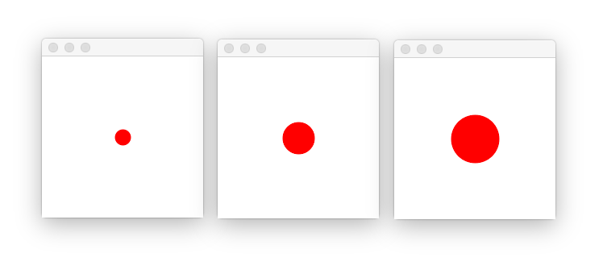

<meta name="title" content="Java">
<meta name="subtitle" content="introduction">
<meta name="objective" content="learn computer science with the Java programming language">
<meta name="author" content="keshavsaharia">
<meta name="color" content="purple">
<meta name="text" content="Learn computer science through games and animations.">
<meta name="done" content="false">
<meta name="lessons" content="start,drawing,animation,test">

---

# Java

This is an open-source Java curriculum based on the [APCS graphics library](https://apcs.io).

You will learn how to
- do this
- and that

And write code like this

```java
System.out.println("Hey!")
System.out.println("----")
```

And `more code` test

testing

---
<meta name="template" content="start">

Here is some more data on how to get started.


