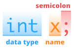
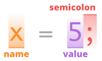
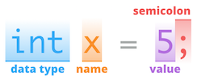
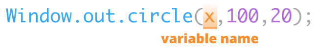

<meta name="title" content="Animation">
<meta name="type" content="lab">
<meta name="text" content="Animate with graphics functions.">
<meta name="objective" content="be introduced">
<meta name="author" content="keshavsaharia">
<meta name="path" content="introduction">

---

# Getting started

Create a class named `Animation` that has a `main` method, as shown on the right.

In this lab, we will continue to write instructions in the main method, in the area specified by the comment.

---

# Pausing

> The `Window.sleep` method pauses the program for the given amount of time.

The time to delay is given in milliseconds.

---

# Traffic Light

> Animate a traffic light.

The light should start green, turn yellow after 5 seconds, and turn red after 1 second.

Hint:

First draw the traffic light with a rectangle and three circles.

Then, use `Window.sleep` to add a 5 second delay. The instructions after the delay should draw a black circle over the green circle, and draw a yellow circle over the center circle.

Finally, repeat the same process as above to black out the yellow light and color the red light in the top circle.


---

# Variables

> A variable is a named container for information.

In Java, every variable has a **data type** that identifies the type of information it can contain. A **variable declaration** instruction tells the computer to create a new variable with the given data type. The data type we will use for numbers is `int`, which is short for **integer**.



A **variable assignment** instruction tells the computer to store a specific value in a certain variable. The variable always goes on the left, and the value goes on the right.



A variable can be assigned an **initial value** when it is declared.



A variable name can be used to access the value it contains. For example, we could use a variable as the input to the `Window.out.circle` method, so the value in the variable determines the position of the circle.




---

# Incrementing

> The value stored in a variable can be used to calculate its new value.

For example, `x = x + 1` will first calculate `x + 1`, then store the result in `x`. While the expression `x = x + 1` may not make sense in a mathematical sense, it is interpreted by the computer as put the value of `x + 1` into the variable `x`.

The instruction <code>x = x + 1</code> cannot be written as <code>x + 1 = x</code>.
Java expects a single variable on the left of the equal sign, and an expression on the right side.


---

# Blocks

> A block is a group of instructions.

In Java, a block of instructions is indicated by putting an open curly brace (`{`) before the first instruction, and a closed curly brace (`}`) after the last instruction.

!!! Every open curly brace must be paired with a closing curly brace.
A common error in Java program arises from mismatched curly braces. Indenting instructions in a block, as shown in the diagram, helps prevent indentation errors.


---

# While loop

---

# Lane Divider

> Draw a road separated by a dashed yellow lane divider.

---

# Create your own visual puzzle

https://www.reddit.com/r/mildlyinteresting/comments/2az7da/my_laptops_number_pad_has_the_black_dot_illusion/

---

# Printing output

> You can display any number or text value on the window.

---

# Mouse position

> Certain methods can produce values that you can then use in other parts of your program.

"Window.mouse.getX": "get the mouse x position",
"Window.mouse.getY": "get the mouse y position"

The `Window.mouse.getX` and `Window.mouse.getY` methods produce integers that describe the mouse's `x` and `y` position.

```java
// Wait 1 second
Window.sleep(1000);

// Store the mouse x and y position in two variables
int a = Window.mouse.getX();
int b = Window.mouse.getY();

// Draw a circle at the mouse position
Window.out.circle(a, b, 50);
```

You can also directly insert the result of calling `Window.mouse.getX()` as an argument to `Window.out.circle`.

```java
// Wait 1 second
Window.sleep(1000);

// Draw at the mouse position
Window.out.circle(Window.mouse.getX(), Window.mouse.getY(), 50);
```

---

# Mouse Relay

---

# Mouse Race

---

# Infinite loops

---

# Painting

---

# Multiple paintbrushes
